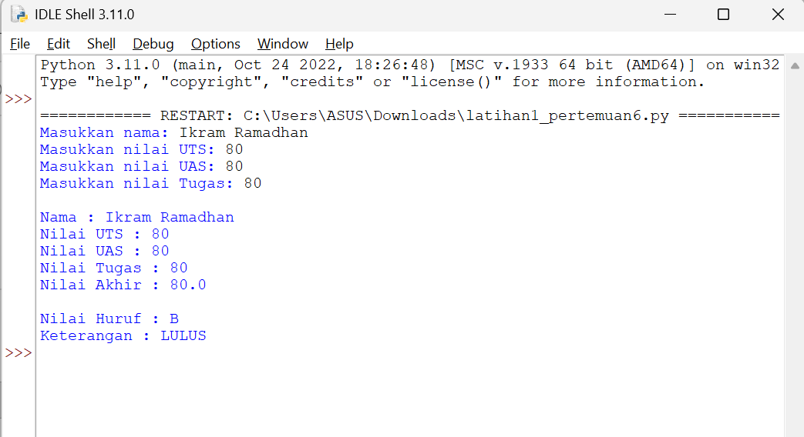
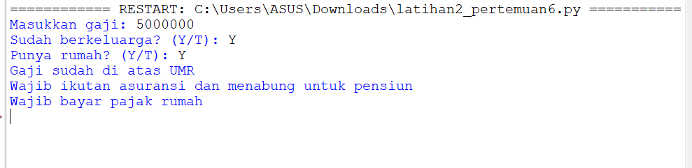
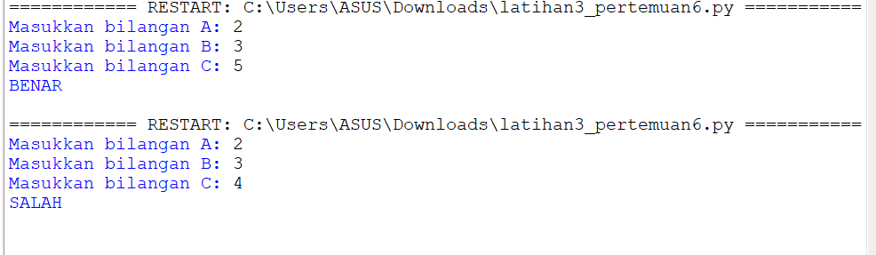
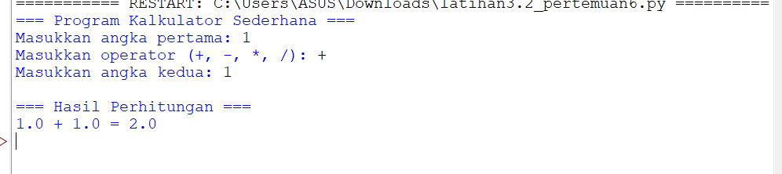
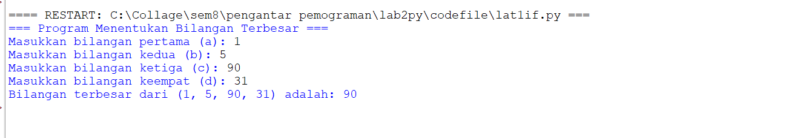
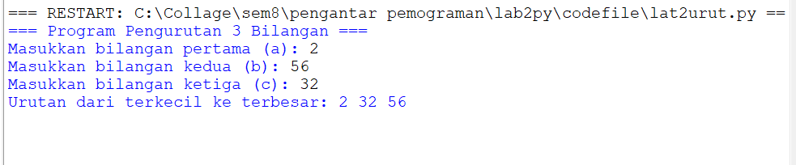

# Pertemuan 6
## Tugas Pengantar Pemograman 
Ini adalah pertemuan 6 dari ikram ramadhan dengan dosen pengampu bapak Agung Nugroho, S.Kom., M.Kom

````shell
Nama   : Ikram Ramadhan
Nim    : 312110478
Matkul : Pengantar Pemograman
````
## code,flowchart dan output program pada materi 1
### latihan 1
````shell

nama = input("Masukkan nama: ")
uts = input("Masukkan nilai UTS: ")
uas = input("Masukkan nilai UAS: ")
tugas = input("Masukkan nilai Tugas: ")

akhir = (int(tugas) * 0.2) + (int(uts) * 0.4) + (int(uas) * 0.4)
keterangan = ("TIDAK LULUS", "LULUS")[akhir > 60.0]

if akhir > 80:
    huruf = "A"
elif akhir > 70:
    huruf = "B"
elif akhir > 50:
    huruf = "C"
elif akhir > 40:
    huruf = "D"
else:
    huruf = "E"

print("\nNama :", nama)
print("Nilai UTS :", uts)
print("Nilai UAS :", uas)
print("Nilai Tugas :", tugas)
print("Nilai Akhir :", akhir)
print("\nNilai Huruf :", huruf)
print("Keterangan :", keterangan)
````
* *Hasil output program:*
  
* *

### latihan 2
````shell
gaji = int(input("Masukkan gaji: "))
berkeluarga = (False, True)[input("Sudah berkeluarga? (Y/T): ") == "Y"]
punya_rumah = (False, True)[input("Punya rumah? (Y/T): ") == "Y"]

if gaji > 3000000:
    print("Gaji sudah di atas UMR")

    if berkeluarga:
        print("Wajib ikutan asuransi dan menabung untuk pensiun")
    else:
        print("Tidak perlu ikutan asuransi")

    if punya_rumah:
        print("Wajib bayar pajak rumah")
    else:
        print("Tidak wajib bayar pajak rumah")

else:
    print("Gaji belum UMR")

````
* *Hasil output program:*
  
  * *

### latihan 3
````shell
a = int(input("Masukkan bilangan A: "))
b = int(input("Masukkan bilangan B: "))
c = int(input("Masukkan bilangan C: "))

if a + b == c or b + c == a or c + a == b:
    print("BENAR")
else:
    print("SALAH")

````
* *Hasil output progragim:*
  
  * *

## latihan 3.1
````shell
print("=== Program Hitung Harga Tiket Bioskop ===")

# Input tipe tiket
tipe = input("Pilih tipe tiket (Reguler/VIP): ").lower()
member = input("Apakah Anda memiliki kartu member? (Y/T): ").upper()

# Tentukan harga berdasarkan tipe tiket
if tipe == "reguler":
    harga = 50000
elif tipe == "vip":
    harga = 100000
else:
    print("Tipe tiket tidak valid!")
    exit()  # keluar dari program jika input salah

# Cek apakah user memiliki kartu member
if member == "Y":
    diskon = 0.2 * harga
else:
    diskon = 0

# Hitung total harga setelah diskon
total = harga - diskon

# Tampilkan hasil
print("\n=== Rincian Pembayaran ===")
print(f"Tipe Tiket     : {tipe.capitalize()}")
print(f"Harga Tiket    : Rp{harga:,}")
print(f"Diskon         : Rp{int(diskon):,}")
print(f"Total Bayar    : Rp{int(total):,}")

````
* *Hasil output progragim:*
  
  * *

## latihan 3.2
````shell
print("=== Program Kalkulator Sederhana ===")

# Input dari pengguna
angka1 = float(input("Masukkan angka pertama: "))
operator = input("Masukkan operator (+, -, *, /): ")
angka2 = float(input("Masukkan angka kedua: "))

# Proses perhitungan
if operator == "+":
    hasil = angka1 + angka2
elif operator == "-":
    hasil = angka1 - angka2
elif operator == "*":
    hasil = angka1 * angka2
elif operator == "/":
    if angka2 != 0:
        hasil = angka1 / angka2
    else:
        hasil = "Error: Tidak bisa dibagi dengan nol!"
else:
    hasil = "Operator tidak dikenal!"

# Output hasil
print("\n=== Hasil Perhitungan ===")
print(f"{angka1} {operator} {angka2} = {hasil}")

````
* *Hasil output progragim:*
  
  * *

  ## code dan output program pada materi 2
### latihan 1
````shell
# Program Menentukan Bilangan Terbesar dari 4 Bilangan
print("=== Program Menentukan Bilangan Terbesar ===")

# Input empat bilangan
a = int(input("Masukkan bilangan pertama (a): "))
b = int(input("Masukkan bilangan kedua (b): "))
c = int(input("Masukkan bilangan ketiga (c): "))
d = int(input("Masukkan bilangan keempat (d): "))

# Menentukan bilangan terbesar menggunakan if bertingkat
if a > b:
    if a > c:
        if a > d:
            terbesar = a
        else:
            terbesar = d
    else:
        if c > d:
            terbesar = c
        else:
            terbesar = d
else:
    if b > c:
        if b > d:
            terbesar = b
        else:
            terbesar = d
    else:
        if c > d:
            terbesar = c
        else:
            terbesar = d

# Output hasil
print(f"Bilangan terbesar dari ({a}, {b}, {c}, {d}) adalah: {terbesar}")

````
* *Hasil output program:*
  
* *

### latihan 2
````shell
# Program sederhana mengurutkan 3 bilangan dari terkecil ke terbesar
print("=== Program Pengurutan 3 Bilangan ===")

# Input tiga bilangan
a = int(input("Masukkan bilangan pertama (a): "))
b = int(input("Masukkan bilangan kedua (b): "))
c = int(input("Masukkan bilangan ketiga (c): "))

# Proses pengurutan menggunakan if else
if a <= b and a <= c:
    if b <= c:
        print("Urutan dari terkecil ke terbesar:", a, b, c)
    else:
        print("Urutan dari terkecil ke terbesar:", a, c, b)
elif b <= a and b <= c:
    if a <= c:
        print("Urutan dari terkecil ke terbesar:", b, a, c)
    else:
        print("Urutan dari terkecil ke terbesar:", b, c, a)
else:
    if a <= b:
        print("Urutan dari terkecil ke terbesar:", c, a, b)
    else:
        print("Urutan dari terkecil ke terbesar:", c, b, a)

````
* *Hasil output program:*
  
* *

### latihan 3
````shell
# Program nested for pola angka bertingkat
print("=== Pola Nested For dari 0 sampai 18 ===")

for i in range(10):          # baris
    for j in range(10):      # kolom
        print(i + j, end="\t")
    print()  # pindah ke baris baru
````
* *Hasil output program:*
  
* *
